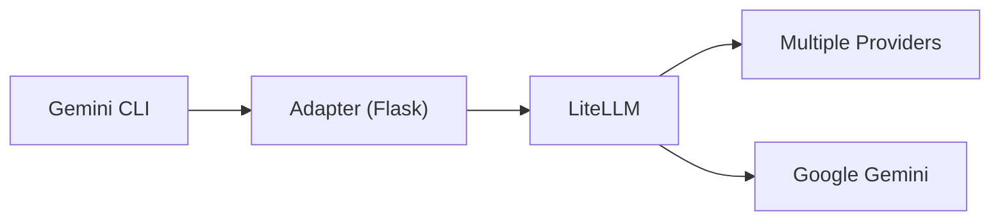

# Gemini CLI Multi-Provider Adapter

A Flask-based adapter that enables the [Gemini CLI](https://github.com/google-gemini/gemini-cli) to work with multiple LLM providers (Google Gemini, OpenAI, DeepSeek, Anthropic, Groq, and more) through [LiteLLM](https://github.com/BerriAI/litellm).

## 🌟 Features

- ✅ **Multi-Provider Support**: Use 6+ providers with a single CLI.
- ✅ **Automatic Model Routing**: Smart detection of providers based on model names.
- ✅ **Robust Translation**: Handles `systemInstruction`, `functionCall`, and `functionResponse`.
- ✅ **SSE Streaming**: Full support for real-time responses in the CLI.
- ✅ **MCP / Tool Support**: Use your MCP servers with any provider.
- ✅ **JSON Logging**: Capture raw and translated requests/responses for debugging.
- ✅ **Process Management**: Robust script for starting, stopping, and monitoring the adapter.

## 🏗 Architecture



The adapter translates between Google's API format and OpenAI's format (used by LiteLLM), ensuring seamless compatibility.

## 🚀 Quick Start

### 1. Setup Environment
Clone the repository and install dependencies:
```bash
# Install dependencies into a virtual environment (recommended)
pipx install flask
pipx inject flask litellm python-dotenv
```

### 2. Configure API Keys
Copy the example environment file and add your keys:
```bash
cp .env.example .env
nano .env  # Add your API keys (e.g., GROQ_API_KEY, OPENAI_API_KEY)
```

### 3. Start the Adapter
Use the management script to start the adapter:
```bash
./manage_adapter.sh start
```

### 4. Route the Gemini CLI to the Adapter
The Gemini CLI needs to know where the adapter is running. While the adapter itself doesn't use this variable, the **Gemini CLI automatically loads environment variables** from `.env` files in the current directory. 

We've added `GOOGLE_GEMINI_BASE_URL` to the project's `.env` so that whenever you run `gemini` in this folder, it is automatically routed to the adapter without any manual `export` commands.

### 5. Run a Prompt
```bash
# Test with Groq (Free and fast!)
gemini prompt "What is the capital of France?" --model "groq/llama-3.3-70b-versatile"
```

### 6. Run Gemini CLI with diff model
```bash
gemini --model "groq/llama-3.3-70b-versatile"
```

### 7. Stop the Adapter
Use the management script to stop the adapter:
```bash
./manage_adapter.sh stop
```

## 🤖 Supported Providers & Models

The adapter automatically routes requests based on the model name:

| Provider | Model Pattern | Example Model |
| :--- | :--- | :--- |
| **Google** | Default | `gemini-2.0-flash-001` |
| **OpenAI** | `gpt-*` or `o1-*` | `gpt-4o-mini` |
| **Anthropic** | `claude-*` | `claude-3-5-sonnet-20241022` |
| **DeepSeek** | `deepseek/*` | `deepseek/deepseek-chat` |
| **Groq** | `groq/*` | `groq/llama-3.3-70b-versatile` |
| **Together AI**| `together_ai/*` | `together_ai/meta-llama/Meta-Llama-3.1-70B-Instruct-Turbo` |

## 🛠 Configuration

### Management Script (`manage_adapter.sh`)
- `./manage_adapter.sh start`: Start the adapter in the background.
- `./manage_adapter.sh stop`: Stop the adapter.
- `./manage_adapter.sh status`: Check if the adapter is running.
- `./manage_adapter.sh health`: Perform an HTTP health check.
- `./manage_adapter.sh logs`: View real-time logs.

### Debugging & JSON Logging
To capture raw and translated JSONs for debugging, set `DEBUG_SAVE_JSON=true` in your `.env`.
The files will be saved to the `debug_logs/` directory:
- `google_request.json`: Raw request from Gemini CLI.
- `openai_request.json`: Translated request sent to LiteLLM.
- `openai_response.json`: Raw response from LiteLLM.
- `google_response.json`: Translated response sent back to CLI.

## 🔍 Technical Details

### Translation Logic
The adapter performs deep translation of the message history:
- **Roles**: Maps `model` → `assistant`, `function` → `tool`.
- **System Instructions**: Converts Google `systemInstruction` to OpenAI `system` role.
- **Tool Calling**:
    - Translates Google `functionCall` to OpenAI `tool_calls`.
    - Translates Google `functionResponse` to OpenAI `tool` messages.
    - Generates stable `tool_call_id`s to maintain conversation state.

### Streaming
Full SSE (Server-Sent Events) support ensures that the Gemini CLI's streaming mode works perfectly with all providers.

## 📜 License
MIT
