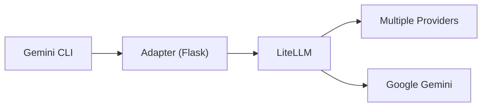

# Gemini CLI Multi-Provider Adapter - Project Plan

## Overview
The goal of this project is to enable the [Gemini CLI](https://github.com/google-gemini/gemini-cli) to work seamlessly with multiple LLM providers (Google, OpenAI, DeepSeek, Anthropic, Groq, Together AI) by using a Flask-based adapter and [LiteLLM](https://github.com/BerriAI/litellm).

## Architecture

The adapter translates Google's API format to OpenAI's format (used by LiteLLM) and back, ensuring that features like MCP servers and tool calling continue to work as expected.

## Roadmap

### Phase 1: Core Implementation (Completed)
- [x] Basic Flask adapter setup.
- [x] Request/Response translation (Google <-> OpenAI).
- [x] SSE Streaming support.
- [x] Smart model routing.
- [x] Basic tool calling support.

### Phase 2: Management & Portability (Completed)
- [x] Environment variable management via `.env`.
- [x] Python startup script (`start.py`).
- [x] Robust management script (`manage_adapter.sh`) with start/stop/status/health/logs.
- [x] Improved portability and dependency detection.

### Phase 3: Reference Data & Refinement (Completed)
- [x] Capture and save reference JSONs for debugging and verification.
- [x] Comprehensive documentation of JSON formats.
- [x] Enhanced error handling and edge case coverage for tool calling.

### Phase 4: Advanced Features (Completed)
- [x] Support for more complex Google API features (e.g., system instructions, safety settings).
- [x] Process management fixes (os.execv, process group killing).
- [x] API version compatibility (/v1/ and /v1beta/).
- [x] Persistent configuration via `.env` files.

## Reference Data Task
To ensure completeness and accuracy of the translation logic, we capture full request/response cycles:
1. **Google Request**: `google_request.json`
2. **OpenAI Request**: `openai_request.json`
3. **OpenAI Response**: `openai_response.json`
4. **Google Response**: `google_response.json`

These files are stored in the `debug_logs/` directory when `DEBUG_SAVE_JSON=true` is set.

### How to Route Gemini CLI
The most reliable way to route the Gemini CLI through the adapter is by setting the `GOOGLE_GEMINI_BASE_URL` environment variable. This can be done persistently by adding it to your project's `.env` file or `~/.gemini/.env`:

```bash
GOOGLE_GEMINI_BASE_URL="http://127.0.0.1:5001"
```

The Gemini CLI automatically loads environment variables from these locations.